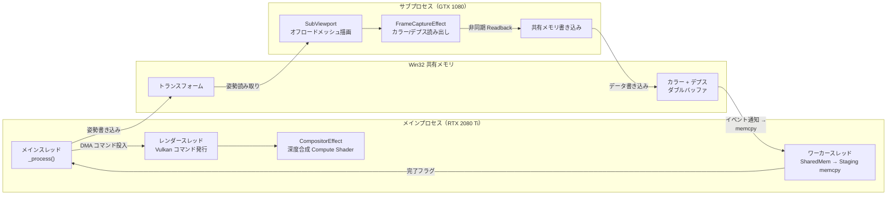

# 概要

本稿は、VR環境における描画負荷をアプリケーション層で複数GPU間に分散するシステムの実装結果を報告する。メインプロセス（RTX 2080 Ti）がシーン全体の描画・合成を担当し、サブプロセス（GTX 1080）が指定メッシュのみをオフロードする二層構造を採用した。プロセス間通信に共有メモリとWin32 Auto-Reset Eventを使用し、深度テスト付きアルファ合成により両GPU描画結果を統合する。メインプロセス144fps、サブプロセス約100fpsで安定動作する実装を達成した。

本稿では、システムのアーキテクチャ、同期機構の設計、データ転送パイプライン、深度合成アルゴリズム、およびGodotエンジンへの3つの新規API追加について報告する。

# はじめに

## 問題設定

VRアプリケーションの描画には高い計算負荷が伴う。HMDの解像度は3K～6Kに達し、ユーザーが物体を間近に視認するため高ポリゴン密度を要求される。従来的なシングルGPU方式では、これらの制約下での120fps以上のフレームレート維持が困難である。

既存のドライバベースマルチGPU技術（SLI/CrossFire）は、同一系統の同一型番GPU群を前提とし、外部メモリ拡張やExternalMemory機構を要求する。異種GPU（例：RTX 2080 Ti + GTX 1080）の組み合わせでは動作しない。このため、アプリケーション層で明示的に役割を分担する新たなアプローチが必要である。

## 先行研究と既存技術

### マルチGPUレンダリング技術の分類

マルチGPUレンダリング技術は大別して三種類に分類される。

**AFR（Alternate Frame Rendering）/SFR（Split Frame Rendering）**: 2000年代のドライバベース技術であり、AFRは各フレームを異なるGPUに割り当て、SFRはフレーム内の領域を分割して描画する。この時代は計算能力が主たるボトルネックであったため、複数GPUで並列計算することで計算量の線形スケーリングを実現しようとした。これらの手法では描画結果がGPUに留まるため、プロセス間のデータ転送は最小限に抑えられていた。

**Sort-last rendering**: グラフィクス分野で提案されたリサーチテーマであり、各GPUが異なる部分ジオメトリを独立して描画し、最終合成ステップで結果をマージする手法である。ピクセルレベルの深度テストを伴うため、メインメモリ経由での転送が必然的になり、PCIeバス帯域（当時のPCIe 2.0で最大8GB/s）が新たなボトルネックとなる。レイテンシが無視できなくなるため、実時間性が要求されるアプリケーションでは採用されなかった。

**DirectX12 Explicit Multi Adapter**: 2010年代にDirectX 12で導入された異種GPU割り当てAPIである。しかし、採用コストの高さが普及の障壁となった。EMAはDirect3D 12という低レベルグラフィクスAPIを直接操作する形で設計されており、アダプターの列挙・ヒープ設計・リソースの手動マイグレーションなど、膨大な実装工数をゲームエンジン・タイトル側の開発者に要求する。この負担から「EMAは企画倒れ」と評されるケースが多く、実際に製品レベルで採用したゲームタイトルはほとんど存在しない。グラフィクスAPIをアプリケーション側で切り替えること自体が技術的難易度の高い作業であり、ゲーム制作チームがこれを主体的に取り組むインセンティブが得られにくかったことも普及の障壁となった。

### 従来の問題の本質

これらの技術が普及しなかった根本原因は、**計算能力とVRAM容量のバランスの変化を見落とした点**にある。2000年代～2010年代は、VRAM容量（256MB～1GB）に対して計算能力が相対的に不足していたため、AFR/SFRはこの計算能力の不足という時代的ボトルネックに最適化された技術だった。

ところが、VRおよび高解像度コンテンツの普及により、状況は根本的に反転している。HMD解像度が3K～6Kに達するにつれてテクスチャメモリが枯渇する傾向が見られ、一方ではGPU計算能力が飽和の傾向を示すようになった。特にVRでは、ユーザーがオブジェクトを間近に視認するため詳細なテクスチャ解像度が必須となり、VRAM容量の枯渇が顕著な問題として浮上している。

### VR特有の特性

従来のマルチGPU技術（特にSort-last）が実用化されなかった理由の一つは、**入力遅延への感度の高さ**にある。映像ゲーム（FPS等）では遅延が非常に重要であり、メインメモリを経由してのデータ転送による遅延増加は致命的なものとなっていた。

これに対して、VRSNS（メタバース型ソーシャルVR）は異なる特性を持つシステムである。ユーザーアバター群の描画は、ユーザー入力（ヘッドトラッキング）への直接的な反応性を必要としない。アバターの動作はネットワーク同期遅延（通常数十ms）に支配されるため、フレームレンダリング側の遅延（数ms～十数ms）は相対的に無視可能なレベルにとどまる。これによって初めて、メインメモリ経由のデータ転送という従来の制約が許容可能な領域へ入ることになる。

## 設計方針

プロセス分離型の採用を決定した。理由は二つである。第一に、GPU障害時の隔離が可能になることである。サブプロセスがドライバエラーで停止しても、メインプロセスは継続稼働し、サブプロセスのみ再起動できるようになる。第二に、GPU割り当ての柔軟性が実現されることである。サブプロセスを `--gpu-index` オプションで起動するだけで特定GPUへ割り当てられ、特殊なドライバ機能を要しなくなる。

本システムがVRSNS向けに適用可能である背景は、Sort-last系の手法が従来不採用だった理由（入力遅延）がこのドメインでは許容可能となるという認識に基づいている。

# システムアーキテクチャ

## 全体構成

本システムは以下の3要素で構成される。

- **メインプロセス**：通常のGodotエンジン。シーン全体の描画、フレームデータの受信、深度合成を担当。3つのスレッド（メイン、ワーカー、レンダー）が協調動作する。
- **サブプロセス**：指定メッシュのみを描画する最小限のGodotエンジン。フレームバッファをキャプチャし、共有メモリへ書き込む。
- **Win32共有メモリ**：プロセス間のフレームデータ転送媒体。カラーバッファ、デプスバッファ、トランスフォーム情報、初期化ペイロードを格納。

## 共有メモリレイアウト

共有メモリは固定長で設計される。レイアウトは表1のとおりである。

| 領域 | サイズ | 内容 |
|------|--------|------|
| Transform Buffer | 80B | カメラ位置姿勢（28B）、FOV/Near/Far（12B）、オブジェクト変換（40B） |
| Color Buffer | 約33.1MB | RGBA16F 1920×1080 × 2（ダブルバッファ） |
| Depth Buffer | 約16.5MB | float32 1920×1080 × 2（ダブルバッファ） |
| Init Buffer | 2048B | JSON形式初期化情報 |

ダブルバッファリングにより、write_indexとread_indexを位相反転することで、データ競合を構造的に排除する。

## 同期機構

プロセス間同期には2つのWin32 Auto-Reset Eventを使用する（表2）。

| イベント | 方向 | 用途 |
|---------|------|------|
| TransformReady | メイン→サブ | カメラ姿勢更新完了の通知。サブはポーリング検出 |
| FrameReady | サブ→メイン | カラー/デプス書き込み完了の通知。メインワーカースレッドがブロッキング待機 |

プロセス内スレッド間の同期には、Mutex保護された`new_data_ready`フラグを使用する。ロック区間は状態フラグのみに限定し、大容量memcpy処理中はロックを保持しない。

# データ転送パイプライン

## フロー

フレームデータ転送は4段階で進行する。

```mermaid
graph LR
    subgraph SubProc["サブプロセス（GTX 1080）"]
        S1["GPU 描画"]
        S2["非同期 Readback<br/>GPU VRAM → CPU"]
        S3["共有メモリ書き込み<br/>ダブルバッファ"]
        S4["frame_ready_event<br/>SetEvent()"]
    end
    subgraph MainProc["メインプロセス（RTX 2080 Ti）"]
        M1["ワーカースレッド<br/>WaitForSingleObject()"]
        M2["memcpy<br/>共有メモリ → ステージングバッファ"]
        M3["メインスレッド<br/>完了フラグ検出"]
        M4["レンダースレッド<br/>vkCmdCopyBufferToImage"]
        M5["GPU DMA 転送<br/>ステージング → テクスチャ"]
        M6["CompositorEffect<br/>深度合成"]
    end
    S1 --> S2 --> S3 --> S4
    S4 -->|"イベントシグナル"| M1
    M1 --> M2
    M2 -->|"new_data_ready = true"| M3
    M3 -->|"call_on_render_thread()"| M4
    M4 --> M5 --> M6
```

各段階は異なるスレッド/ハードウェアユニットで実行され、パイプライン化による並列処理が実現される。

## Godotエンジンへの新規API

標準の`texture_update()`API内では毎フレーム一時ステージングバッファを同期的に確保・破棄するため、大容量データ転送に不適切である。本システムでは、RenderingDeviceに3つのAPIを追加した。

### staging_buffer_create

`VK_BUFFER_USAGE_TRANSFER_SRC_BIT` + `HOST_VISIBLE | HOST_COHERENT`メモリを持つ永続ステージングバッファを作成する。毎フレームの一時確保を廃止し、メモリ確保コストを初期化時の1回に集約する。

### staging_buffer_get_ptr

`vkMapMemory`により永続マッピングしたポインタを返却する。以降、毎フレームはmemcpyのみでデータ書き込みが可能となり、Map/Unmapの反復コストを排除する。

### texture_copy_from_staging_buffer

`vkCmdCopyBufferToImage`コマンドを記録する。CPU側はコマンド投入のみを担当し（1ms未満）、実転送はGPU DMAエンジンが描画パイプラインと独立して実行される。

## ワーカースレッドの動作

GDScript Thread として起動されたワーカースレッドは、以下のループで動作する。

1. `frame_ready_event.wait_event(100)`でサブプロセスイベント待機
2. イベント受信後、`current_buffer_index`に基づきダブルバッファの該当側を選択
3. `memcpy`で共有メモリ→永続ステージングポインタへコピー
4. Mutexをロック、`new_data_ready = true`を設定
5. `current_buffer_index`をトグル

約65msの重いmemcpy処理はワーカースレッドで実行されるため、メイン・レンダースレッドをブロックしない。

## メインスレッドの処理

`_process()`内での処理は3ステップで軽量化されている。

1. `worker_mutex`ロック、`new_data_ready`フラグ確認後`false`に戻す
2. `RenderingServer.call_on_render_thread()`経由でDMA転送コマンド投入
3. `copy_queued`フラグ設定、次フレーム先頭でダブルバッファインデックスを入れ替え

全処理は1ms未満で完了する。

# サブプロセスの実装

## 初期化フロー

サブプロセスはIPCManager経由で`OS.create_process()`で起動される。起動引数に`--gpu-index 1`を含め、セカンダリGPUへ割り当てる。`--render-thread separate`オプションで描画コマンド発行を専用スレッドに委譲する。

起動後、サブプロセスは共有メモリバッファとイベントを`open_buffer()` / `open_event()`で開く。Init Bufferからメッシュ・マテリアルリソースパスを取得し、シーンを再構築する。

IPCManager はウォッチドッグ機能を備え、サブプロセスの生存を2秒間隔で確認する。停止時は最大3回まで自動再起動を試みる。

## フレームループ

サブプロセスの`_process()`は3ステップで構成される。

1. **フレーム完了通知**：前フレームの非同期Readback完了確認後、`frame_ready_event.set_event()`でシグナル発行
2. **姿勢同期**：`transform_ready_event.check_event()`でメイン側更新を検出、トランスフォーム適用
3. **非同期キャプチャ要求**：FrameCaptureEffectへダブルバッファオフセット設定、`current_buffer_index`トグル

フレーム完了通知を次フレーム冒頭で行う理由は、前フレームのGPU読み出し完了を確実に待つためである。

## FrameCaptureEffect：GPU読み出しの実装

FrameCaptureEffectはCompositorEffectとしてSubViewport描画パイプラインの`POST_TRANSPARENT`フェーズにアタッチされる。

Godot内部レンダバッファは`TEXTURE_USAGE_CAN_COPY_FROM_BIT`フラグを有しないため、直接コピーが不可能である。本システムは2段階で回避する。

### 段階1：Compute Shaderによるステージングテクスチャへのコピー

`frame_capture_copy.glsl`が内部バッファ（`STORAGE_BIT`アクセス可能）から`STORAGE_BIT + CAN_COPY_FROM_BIT`を持つステージングテクスチャへコピーする。深度バッファ（D32_SFLOAT形式）は`sampler2D`経由で読み出し、R32_SFLOAT ステージングテクスチャへ`imageStore()`で書き込まれる。

### 段階2：非同期テクスチャ読み出し

ステージングテクスチャから`request_texture_read_async()`で GPU VRAM→CPU への非同期読み出しを要求する。読み出しデータは共有メモリダブルバッファの該当オフセットへ直接書き込まれる。

# 深度合成

## アルゴリズム

メインプロセス側CompositorEffect（`CompositorEffectIPC`）は、POST_TRANSPARENTフェーズでCompute Shaderを実行する。4つの入力を受け取る。

| バインディング | 種別 | 内容 |
|--------------|------|------|
| 0 | image2D (読み書き) | メインカラーバッファ |
| 1 | sampler2D | メイン深度バッファ |
| 2 | sampler2D | サブカラーテクスチャ |
| 3 | sampler2D | サブ深度テクスチャ |

合成は3ステップで行われる。

### ステップ1：透明画素の早期棄却

サブ側アルファ値≤0.001の場合、サブ描画が存在しないと判定。メイン側カラーをそのまま維持する。

### ステップ2：深度比較

Godot/Vulkanは Reverse-Z 深度バッファを使用する。深度値が大きいほど物体が近い。条件`d_sub > d_main`でサブが手前と判定される。

### ステップ3：アルファ合成

サブが手前の場合、Pre-multiplied Alpha Over演算を適用し、サブが奥にある場合はメイン側カラーを維持する。

## Compute Shader の並列処理

Compute Shaderは8×8のスレッドグループで各ピクセルを並列処理し、ピクセルレベルの正確な合成を実現する。

# MGPUMeshInstance3D

オフロード対象メッシュの指定は、`MGPUMeshInstance3D`コンポーネントとして集約される。シーン構築者は通常の`MeshInstance3D`の代わりにこのノードをアタッチするだけで、内部IPCを意識せずにオフロードを設定できる。

`MGPUMeshInstance3D`は`_ready()`時に自身を非表示に設定し（メインプロセスでは非表示）、`mgpu_mesh_instances`グループに登録される。メインプロセスはこのグループからノードを検出し、`get_init_payload()`でメッシュ・マテリアルパスを取得、Init Buffer経由でサブプロセスに送信する。サブプロセスは受信したパスからリソースをロードし、自身のシーン内で描画を行う。

# プロトコル設計

## CMD FIFO

Main ↔ Sub の双方向コマンド送信に、固定スロットFIFOを使用する（表3）。

| パラメータ | 値 |
|-----------|-----|
| スロット数 | 256 |
| スロットサイズ | 256B |
| ヘッダ | 16B（head, tail, slot_count, slot_size） |
| 合計サイズ | 約64KB |

プロデューサはtailにデータ書き込み後、tailを更新する。部分読み出しを防止するためデータ書き込み→tail更新の順序を厳密に実行する。コンシューマはheadを参照してスロットを読み取り、読み取り後にheadを更新する。

対応コマンド：`CMD_LOAD_RESOURCE`、`CMD_SPAWN_ENTITY` / `CMD_DESTROY_ENTITY`、`CMD_ANIM_PLAY` / `CMD_ANIM_STOP` / `CMD_ANIM_SEEK`、`CMD_HANDSHAKE`、`CMD_SHUTDOWN`

## FRAME Triple Buffer

高頻度フレームデータ（カメラ姿勢、トランスフォーム群、スケルトンポーズ、ブレンドシェイプ）の交換にはトリプルバッファを使用する（表4）。

| パラメータ | 値 |
|-----------|-----|
| スロット数 | 3 |
| スロットサイズ | 64KB |
| ヘッダ | 16B（write_slot, ready_slot, read_slot, slot_size） |

プロデューサはwrite_slotにデータ書き込み、ready_slot = write_slotに設定してデータを公開、次の空きスロットをwrite_slotに割り当てる。コンシューマはready_slotをread_slotにスワップして読み取る。write/ready/read の3スロットローテーションにより、ロックなしでプロデューサとコンシューマの同時動作が実現される。

# ハードウェア構成と性能

## 実験環境

| 要素 | 仕様 |
|------|------|
| メインGPU | NVIDIA RTX 2080 Ti |
| サブGPU | NVIDIA GTX 1080 |
| 解像度 | 1920×1080 |
| 転送データ形式 | RGBA16F + float32 |

異種GPU構成を前提とすることで、余剰GPU の有効活用と構成コストの削減が可能になる。SLIブリッジなどの物理接続は不要で、PCIeスロットに挿すだけで運用できる。

## 測定結果

- メインプロセス：144fps（VSync上限）安定稼働
- サブプロセス：約100fpsで安定動作
- ワーカースレッド memcpy：約65ms/フレーム
- メインスレッド処理：1ms未満
- 転送帯域：1920×1080 RGBA16F + float32で約50MB/フレーム

PCIe 3.0バスは理論値16GB/sであり、50MB/フレームは十分に処理可能である。ワーカースレッドでのmemcpyが重いにもかかわらず、メインスレッドの`_process()`処理が軽量であるため、メイン描画フレームレートへの影響は生じない。

# 考察

## 設計上の重要な決定事項

本システムで採用した主要な設計原則を整理する。

1. **プロセス分離**：GPU障害の隔離と柔軟な割り当てを実現
2. **共有メモリ + イベント同期**：ドライバ依存性を排除した通信基盤
3. **永続ステージングバッファ**：毎フレームのメモリ確保・解放コストを排除
4. **ワーカースレッド分離**：重いmemcpyをメイン・レンダースレッドから隔離
5. **GPU DMA転送**：CPU同期をコマンド投入に置換
6. **Compute Shader合成**：GPU並列処理によるピクセル単位の正確な合成

## 適用可能性

これらの設計原則はVRに限定されない。映像合成、遠隔レンダリング、計測可視化など、転送と描画が絡む高負荷リアルタイムシステム全般に適用可能である。

特に、プロセス分離型アーキテクチャはネットワーク化が容易であり、サブ描画を別マシンへ移行することも可能である。

## 本研究の新規性

本システムの新規性は、**VRSNS特有の制約条件下で従来不採用だったSort-last型手法が採用される点**にある。以下、その根拠を述べる。

### 新たなボトルネック構造

2000年代のSort-lastが不採用だった理由は、入力遅延感度の高さにあり、背景には計算能力がボトルネックだったという事情が存在していた。しかし、VRSNSでは状況が異なる。

- **入力遅延の許容度が高い**：アバター描画がネットワーク同期遅延（50～100ms）に支配されるため、描画側の遅延（数ms）は相対的に無視可能になる
- **VRAMが真のボトルネック**：高解像度テクスチャ、複数アバターモデル、詳細ジオメトリにより、単一GPUのVRAM（典型的に8～12GB）が先に枯渇する傾向が見られる

このボトルネック構造の反転により、Sort-last系手法が初めて実用的になる可能性が生じた。

### 動的メモリ配置による新規なアプローチ

本実装を基盤として、さらなる最適化が可能である。その方法は、**カメラとアバターの距離・向きを動的に監視し、VRAM配置を自動決定する戦略**を採用することにある。

具体的には以下の手順で実現される。

1. **距離・視野角に基づく優先度決定**：各アバターとカメラの距離およびヘッド方向との角度を計算する
2. **メイン/サブGPUへの動的割り当て**：視野内で近距離のアバターはメインGPUにロードし、遠距離のアバターはサブGPUへ配置する
3. **シームレスな転送**：サブで描画中のアバターがカメラに接近した場合、メインへテクスチャをコピーしてから描画主体をシフトさせることで、視覚的な不連続性を排除する
4. **メモリ解放**：視野外になったアバターをサブから除去し、VRAM圧力を軽減する

このアプローチは従来のSort-lastにはない動的特性をもたらす。描画対象の距離や視認性に応じてGPU間のメモリ配置を実時間で最適化することにより、固定的な分割では実現不可能な総VRAM効率の向上が実現される。特にVRメタバースでは、ユーザー周辺のアバター数が時々刻々変化するため、このような動的戦略の効果が顕著に現れるはずである。

# まとめ

本稿は、Godotエンジン上でマルチGPU分散描画を実装したシステムの設計と実装結果を報告した。プロセス間通信に共有メモリとWin32 Eventを採用し、永続ステージングバッファとGPU DMA転送によりデータ転送パイプラインを最適化している。Compute Shaderによる深度合成により、両GPU描画結果をピクセル単位で正確に統合する。

メインプロセス144fps、サブプロセス約100fpsで安定動作し、メイン側処理は1ms未満に収まるため、VR用途に適した性能が達成されている。

本システムの本質的な意義は、VRSNSドメイン固有の特性（入力遅延許容度の高さ、VRAMボトルネック）に基づき、従来不採用だったSort-last型手法を復権させたことにある。さらに、カメラ位置やユーザー視野に基づくリアルタイムなVRAM配置最適化により、将来的な動的マルチメッシュ対応が実現可能になり、高密度アバター環境での描画効率の大幅な向上が期待される。
